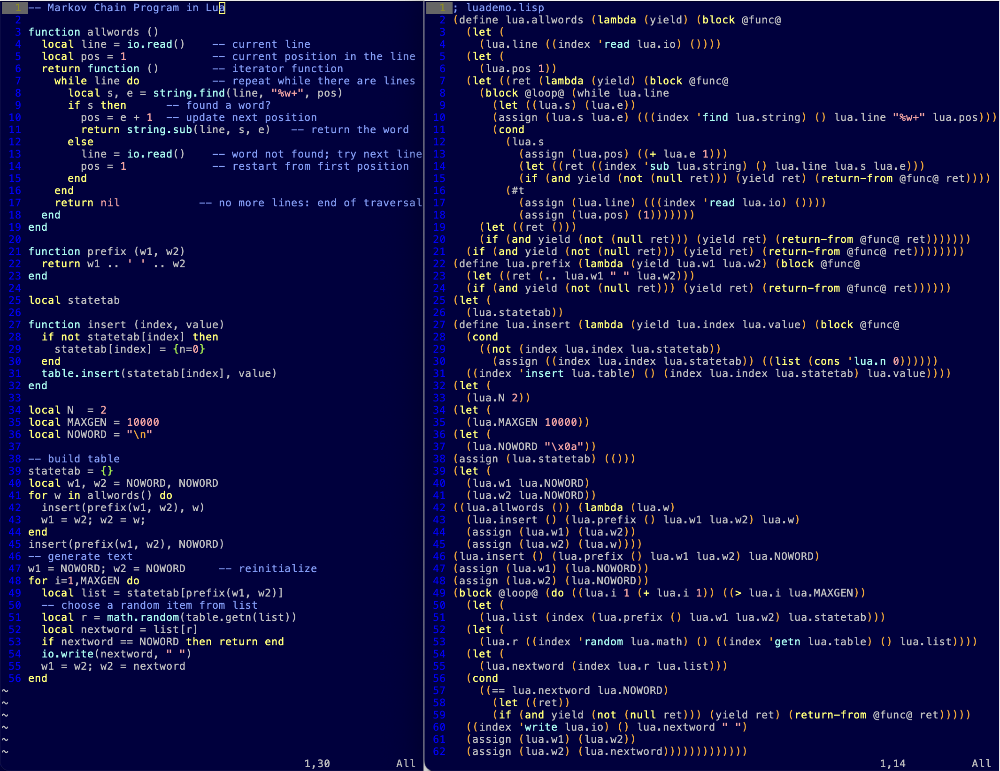

Lua to Lisp transpiler
======================

I spent a satisfying weekend writing a Lua-to-Lisp transpiler in [Bison](https://www.gnu.org/software/bison/) and [RE/flex](https://github.com/Genivia/RE-flex) a modern alternative to Flex for C++.  The transpiler translates Lua language constructs to Lisp.  Dare I say that Lua is essentially sugared Lisp?  A [quote](http://paulgraham.com/rootsoflisp.html) by Paul Graham comes to mind *"As computers have grown more powerful, the new languages being developed have been moving steadily toward the Lisp model."*

The first step was to locate the Lua 5.3 grammar, which can be found in the [Lua 5.3 reference manual](https://www.lua.org/manual/5.3/manual.html).  There are also older [Lua grammars](http://lua-users.org/wiki/LuaGrammar) on the web.

The [Bison LALR grammar for Lua 5.3](#lua-5.3-grammar-for-bison-3.2-or-greater) that I put together for this project comes from Lua's manual.  It has four shift-reduce conflicts that are due to Lua's well-known ambiguity.  This is not a problem at all, because Bison performs a shift by default.  This shift corresponds to Lua's rule that an open parenthesis after an expression is part of the current expression or function call, even when the open parenthesis is placed on the next line.  Semicolons are optional in Lua and can be used to enforce statement separation.

All of the Lua 5.3 syntax and semantics are covered by the transpiler, except for gotos and low-level stuff such as metatables and integration with C.  Perhaps I will add support for gotos later.

## How to transpile Lua to Lisp

The `lua2lisp` transpiler converts Lua to Lisp in two phases:

1. parse Lua code to build an abstract syntax tree using an [abstract grammar](#lua-abstract-grammar) of C++ classes.
2. recursively invoke `transpile` member functions of the abstract syntax tree to generate Lisp.

Execution `lua2lisp` on a Lua source code file produces a Lisp file:

    $ ./lua2lisp luademo.lua
    Saved luademo.lisp

The generated Lisp code is based on Common Lisp, but is not necessarily specific to Common Lisp.

The `transpile` member functions perform the following translations.

### Constants

Lua constants are translated to Lisp constants:

    nil => ()
    true => #t
    false => #f
    <integer> => <integer>
    <string> => <string>

All values are truthy except `nil` and `false` that are falsy in Lua and in Lisp.

Lua strings are translated to Lisp UTF-8 encoded strings by applying the appropriate Lua escapes.

### Variables

Lua variables are translated to Lisp with a `lua.` prefix to prevent name clashes with Lisp symbols.  The elipsis is translated as is:

    <name> => <lua.name>
    ... => ...

Important: Lisp is assumed to produce `nil` for unassigned variables, like Lua produces `nil` for unassigned variables.  Most Lisp don't do this.  Either the Lisp interpreter should be adjusted or each Lua `<name>` should be translated to:

    <name> => (lookup <lua.name>)

where `lookup` returns `nil` if `<lua.name>` is unassigned.

### Tables

A Lua table is translated to a Lisp list of key-value pairs:

    { <expr1>, <name> = <expr2>, [ <expr3> ] = <expr4> }
    =>
    ( (1 . <expr1>) ('name . <expr2>) (<expr3> . <expr4>) )

### Indexing

Named tables (tables assigned to variables) are (recursively) indexed as follows:

    <name1>.<name2>.<name3>...<namek>
    =>
    ((index '<namek> ... (index 'name3 (index '<name2> <lua.name1>))...))

    <name>[<expr>]
    =>
    (index <expr> <lua.name>)

The Lisp `index` function searches a table for a matching key to return the corresponding value or `nil` when not found.

A symbol `'<namek>` should match a string "namek" in the table, because Lua `name.key` and `name["key"]` are identical.

### function

All Lua functions and methods are translated to Lisp lambdas with an extra first `yield` parameter.  The `yield` parameter is used with iterators.  When the function or method is called as an iterator, `yield` is a closure with the `for` iterator loop body.  The closure is called by the function or method with the return value(s) of this function or method.  That is, instead of the function or method returning to the caller, it passes the return value(s) to the `yield` closure.  Otherwise, when the function or method is not called as an iterator, `yield` is `nil`.  As a consequence, the translated Lisp code for a Lua `return <values>` is a bit more complicated to test for `yield` and to locally save the return value(s) in `ret`:

      (let ((ret <values>))
      (if (and yield (not (null ret))) (yield ret) (return-from @func@ ret)))))

When a Lua method is defined with a colon name, an extra second `lua.self` parameter is inserted with the object passed to the method.

A `return` may appear anywhere in a function or a method to return the specified value(s).  If no value is specified, `nil` is returned.

Anonymous function (lambda):

    function (<params>) <body> return <values> end
    =>
    (lambda (yield <params>) (block @func@
      <body>
      (let ((ret <values>))
      (if (and yield (not (null ret))) (yield ret) (return-from @func@ ret)))))

Function and method parameters with elipsis:

    function (<params> ...) <body> return <values> end
    =>
    (lambda (yield <params> . ...) (block @func@
      <body>
      (let ((ret <values>))
      (if (and yield (not (null ret))) (yield ret) (return-from @func@ ret)))))

Function definition:

    function <name> (<params>) <body> return <values> end
    =>
    (define <lua.name> (lambda (yield <params>) (block @func@
      <body>
      (let ((ret <values>))
      (if (and yield (not (null ret))) (yield ret) (return-from @func@ ret))))))

Method definition:

    function <name1.name2...namek> (<params>) <body> return <values> end
    =>
    (assign ((index 'namek ... (index 'name2 lua.name1)...)) ((lambda (yield <params>) (block @func@
      <body>
      (let ((ret <values>))
      (if (and yield (not (null ret))) (yield ret) (return-from @func@ ret))))))

Method definition with a colon name:

    function <name1.name2...:namek> (<params>) <body> return <values> end
    =>
    (assign ((index 'namek ... (index 'name2 lua.name1)...)) ((lambda (yield lua.self <params>) (block @func@
      <body>
      (let ((ret <values>))
      (if (and yield (not (null ret))) (yield ret) (return-from @func@ ret))))))

Function returns are `nil` when no value is specified, one value or a list of multiple values.

### local

Lua local variables and functions are translated to Lisp `let` forms:

    local name1,name2,... = expr1,expr2,...
    =>
    (let ((name1 expr1) (name2 expr2) ...)

An important point is that a `let` is not closed until the end of the block in which the `local` are declared.

A local function:

    local function <name> (<params>) <body> return <values> end
    =>
    (letrec ((<lua.name> (lambda (yield <params>) (block @func@
      <body>
      (let ((ret <values>))
      (if yield (yield ret) (return-from @func@ ret)))))))

The `letrec` is not closed until the end of the block in which the `local function` is declared.

### do

A Lua `do` block is translated to a Lisp `begin` special form:

    do <body> end
    =>
    (begin <body>)

### if

A Lua `if` with zero of more `elseif` branches is translated to a Lisp `cond` special form:

    if <expr1> then <body1> elseif <expr2> then <body2> ... else <bodyk> end
    =>
    (cond
      (<expr1> <body1>)
      (<expr2> <bpdy2>)
      ...
      (#t <bodyk>))

### while and until

A `while` and `until` loop is translated to a Lisp `while` and `until` loop special form, respectively.

A `break` may appear anywhere in a loop to terminate the loop.

    while <expr> do <body> break end
    =>
    (block @loop@ (while <expr> <body> (return-from @loop@)))

    repeat <body> until <expr>
    =>
    (block @loop@ (until <expr> <body> (return-from @loop@)))

### for counter loop

A `for` counter loop is translated to a Lisp `do` loop special form.

A `break` may appear anywhere in a loop to terminate the loop.

    for <name> = <start>,<end>,<step> do <body> break end
    =>
    (block @loop@ (do ((<lua.name> <start> (+ <lua.name> <step>)) ((> <lua.name> <end>))
      <body>
      (return-from @loop@))))

The `<step>` value is optional and defaults to one.

### for iterators loop

A `for` iterators loop is translated to a Lisp `let` to define a `yield` closure that is passed to the iterator functions:

    for <name1>,<name2>,...,<namek> in <iterator1>,<iterator2>,...,<iteratorm> do <body> end
    =>
    (let ((yield (lambda (ret) (let ((<lua.name1> (nth 1 ret)) (<lua.name2> (nth 2 ret)) ... (<lua.namek> (nth k ret)))
      <body>))))
    (<iterator1> yield)
    (<iterator2> yield)
    ...
    (<iteratorm> yield))

The `iterators` are (anonymous) functions that invoke the `yield` closure typically repeatedly with a Lua `return` value(s) until the value is `nil`.  The Lua `return` is a Lisp `yield` call if a `yield` closure is specified and `ret` is not `nil`, otherwise it is a `return-from @func@`.  See [function](#function).

Unlike other loops, `break` in `for` iterator loops is not supported at this time.  To support a `break` in a `for` iterator loop, the Lua `break` should be translated in general to throw an exception to exit the iterator function and terminate the loop.  This adds Lisp code that clutters the logic, so I left it out for now.

If only one `<name>` is specified with a `for` iterator loop, then the generated code is simpler:

    for <name> in <iterator1>,<iterator2>,...,<iteratorm> do <body> end
    =>
    (let ((yield (lambda (<lua.name>)
      <body>)))
    (<iterator1> yield)
    (<iterator2> yield)
    ...
    (<iteratorm> yield))

If only one `<name>` is specified and only one iterator, then the generated code is even simpler:

    for <name> in <iterator> do <body> end
    =>
    (<iterator> (lambda (<lua.name>)
      <body>))

### Assignment

A Lua assignment is a multi-way assignment translated to Lisp `assign`:

    <var1>,<var2>,...,<vark> = <expr1>,<expr2>,...,<exprm>
    =>
    (assign (<var1> <var2> ... <vark>) (<expr1> <expr2> ... <exprm>))

The `<var>` left-hand sides can be expressions such as table indices:

    foo.bar[3] = 7
    =>
    (assign ((index 3 (index 'bar lua.foo))) (7))

The `assign` special form does not evaluate its first argument, which is a list of `<var>` expressions to assign.  It first evaluates the second argument, which is a list of `<expr>` values to assign.  Then the list of `<var>` expressions is traversed to assign the named variables and table indices.  Lua requires that the index argument of the `index` function is evaluated first for all `index` expressions in `<var>` to determine the table index.  For example:

    i = 3
    i, a[i] = i+1, 20

sets `a[3]` to 20.  In the Lisp translation the `i` in `(index i a)` is evaluated first before `i` is assigned.  This requires two passes over `<var>`.

The `assign` special form also accounts for cases when we have fewer `<expr>` than `<var>` and when a function returns more than one value (in a list).

### Goto

Goto is not supported at this time.  It is theoretically possible, but it significantly clutters the logic.

## Lua 5.3 grammar for Bison 3.2 or greater

The Lua 5.3 grammar for Bison 3.2 with reduce/reduce conflict eliminated by expanding `prefixexp`:

    %token
      AND      "and"
      BREAK    "break"
      DO       "do"
      ELSE     "else"
      ELSEIF   "elseif"
      END      "end"
      FALSE    "false"
      FOR      "for"
      FUNCTION "function"
      IF       "if"
      IN       "in"
      LOCAL    "local"
      NIL      "nil"
      NOT      "not"
      OR       "or"
      REPEAT   "repeat"
      RETURN   "return"
      THEN     "then"
      TRUE     "true"
      UNTIL    "until"
      WHILE    "while"
      EQU      "=="
      NEQ      "~="
      LTE      "<="
      GTE      ">="
      CAT      ".."
      SHL      "<<"
      SHR      ">>"
      DIV      "//"
      DOTS     "..."
    ;

    %token '#' '%' '&' '(' ')' '*' '+' ',' '-' '.' '/' ':' ';' '<' '=' '>' '[' ']' '^' '{' '|' '}' '~'

    %left      OR
    %left      AND
    %left      EQU NEQ LTE '<' GTE '>'
    %right     CAT
    %left      '|'
    %left      '~'
    %left      '&'
    %left      SHL SHR
    %left      '+' '-'
    %left      '*' '/' '%' DIV
    %right     NOT '#'
    %right     '^'

    // we expect four shift-reduce conflicts due to Lua's optional semicolon, must always shift on '('
    %expect 4

    %%

    chunk       : block

    semi        : ';'
                |

    block       : scope statlist
                | scope statlist laststat semi

    ublock      : block UNTIL exp

    scope       :
                | scope statlist binding semi
                
    statlist    :
                | statlist stat semi

    stat        : DO block END
                | WHILE exp DO block END
                | repetition DO block END
                | REPEAT ublock
                | IF conds END
                | FUNCTION funcname funcbody
                | setlist '=' explist1
                | funccall

    repetition  : FOR NAME '=' explist23
                | FOR namelist IN explist1
                
    conds       : condlist
                | condlist ELSE block

    condlist    : cond
                | condlist ELSEIF cond

    cond        : exp THEN block
                
    laststat    : BREAK
                | RETURN
                | RETURN explist1

    binding     : LOCAL namelist
                | LOCAL namelist '=' explist1
                | LOCAL FUNCTION NAME funcbody

    funcname    : dottedname
                | dottedname ':' NAME

    dottedname  : NAME
                | dottedname '.' NAME

    namelist    : NAME
                | namelist ',' NAME

    explist1    : exp
                | explist1 ',' exp

    explist23   : exp ',' exp
                | exp ',' exp ',' exp

    exp         : NIL
                | TRUE
                | FALSE
                | NUMBER
                | STRING
                | DOTS
                | function
                | var
                | funccall
                | tableconstr
                | NOT exp
                | '#' exp
                | '-' exp %prec NOT
                | '~' exp %prec NOT
                | exp OR exp
                | exp AND exp
                | exp '<' exp
                | exp LTE exp
                | exp '>' exp
                | exp GTE exp
                | exp EQU exp
                | exp NEQ exp
                | exp '|' exp
                | exp '~' exp
                | exp '&' exp
                | exp SHL exp
                | exp SHR exp
                | exp CAT exp
                | exp '+' exp
                | exp '-' exp
                | exp '*' exp
                | exp '/' exp
                | exp DIV exp
                | exp '%' exp
                | exp '^' exp
                | '(' exp ')'
                
    setlist     : var
                | setlist ',' var

    var         : NAME
                | var '[' exp ']'
                | var '.' NAME
                | funccall '[' exp ']'
                | funccall '.' NAME
                | '(' exp ')' '[' exp ']'
                | '(' exp ')' '.' NAME

    funccall    : var args
                | var ':' NAME args
                | funccall args
                | funccall ':' NAME args
                | '(' exp ')' args
                | '(' exp ')' ':' NAME args

    args        : '(' ')'
                | '(' explist1 ')'
                | tableconstr
                | STRING

    function    : FUNCTION funcbody

    funcbody    : params block END

    params      : '(' parlist ')'

    parlist     :
                | namelist
                | DOTS
                | namelist ',' DOTS

    tableconstr : '{' '}'
                | '{' fieldlist '}'
                | '{' fieldlist ',' '}'
                | '{' fieldlist ';' '}'

    fieldlist   : field
                | fieldlist ',' field
                | fieldlist ';' field
                 
    field       : exp
                | NAME '=' exp
                | '[' exp ']' '=' exp

    %%

## Lua abstract grammar

The C++ abstract syntax tree is composed of the following class instances defined by the `Transpiler` class:

| class                | inherits             |
| -------------------- | -------------------- |
| `Name`               |                      |
| `NameList`           |                      |
| `AbstractSyntaxTree` |                      |
| `Expression`         | `AbstractSyntaxTree` |
| `Statement`          | `AbstractSyntaxTree` |
| `Nil`                | `Expression`         |
| `True`               | `Expression`         |
| `False`              | `Expression`         |
| `Integer`            | `Expression`         |
| `Float`              | `Expression`         |
| `String`             | `Expression`         |
| `Dots`               | `Expression`         |
| `Lambda`             | `Expression`         |
| `Table`              | `Expression`         |
| `Call`               | `Expression`         |
| `UnaryOp`            | `Expression`         |
| `Op`                 | `Expression`         |
| `Variable`           | `Expression`         |
| `Index`              | `Expression`         |
| `Member`             | `Expression`         |
| `Block`              | `Statement`          |
| `If`                 | `Statement`          |
| `While`              | `Statement`          |
| `Until`              | `Statement`          |
| `ForCounter`         | `Statement`          |
| `ForIterator`        | `Statement`          |
| `Function`           | `Statement`          |
| `Goto`               | `Statement`          |
| `Label`              | `Statement`          |
| `Assign`             | `Statement`          |
| `FunctionCall`       | `Statement`          |
| `Local`              | `Statement`          |
| `LocalFunction`      | `Statement`          |
| `Break`              | `Statement`          |
| `Return`             | `Statement`          |
| `Condition`          | `AbstractSyntaxTree` |
| `FunctionName`       | `AbstractSyntaxTree` |
| `Parameters`         | `AbstractSyntaxTree` |
| `Range`              | `AbstractSyntaxTree` |
| `Field`              | `AbstractSyntaxTree` |

The `Expression` and `Statement` classes include `transpile` functions to translate Lua to Lisp.
